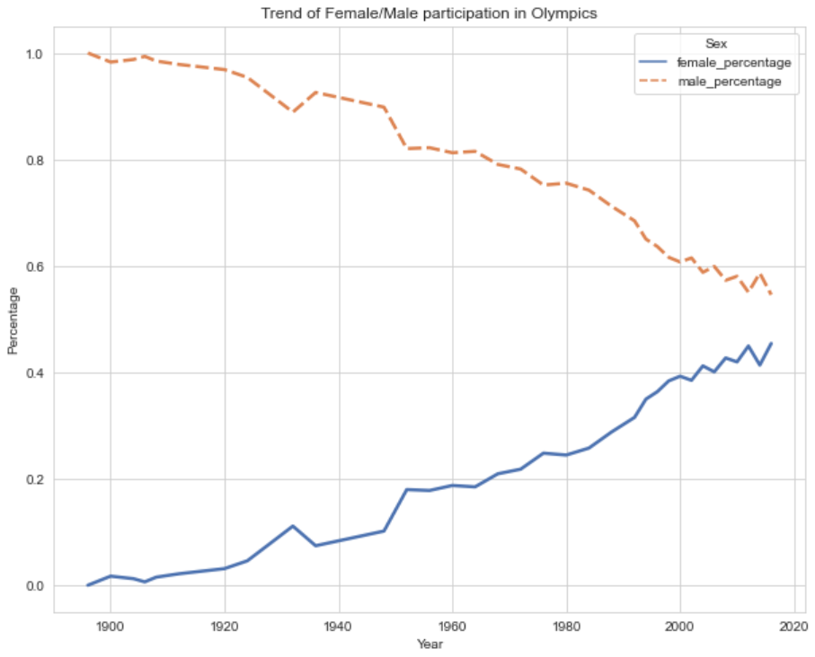
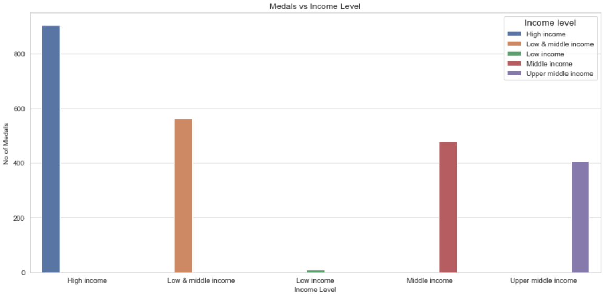

## Data Analysis on Olympics Dataset

### Introduction:

The modern Olympic Games or Olympics are the leading international sporting events featuring summer and winter sports competitions in which thousands of athletes from around the world participate in a variety of competitions. The Olympic Games are considered the world's foremost sports competition with more than 200 teams, representing sovereign states and territories.

Performed exploratory Data Analysis using Python to analyze and visualize past Olympics data and gain valuable insights from it. Explored trends in sport and examine the complex connections between sport, economics and gender. This analysis is expected to help us identify biases and inequality in sport through Olympics history.
  
### Problem Statement:

To examine the complex relationship between sport and gender by evaluating female participation in sport over the years and how the economic status of certain country can affect its opportunity to make achievement in the international sport tournaments.

Hence, the aim of this project is to answer below questions:

•	What countries have the highest female representation and what countries are the lowest? 

•	What is the recent percentage of women athletes in the Olympics and how did it change over time? 

•	What are the top five countries in terms of No of medals achieved throughout the Olympics history and what is the percentage of female representation in these teams? 

•	Does country GDP and expenditure on sport influence the number of medals achieved? Is there any correlation between spending on sport and the number of medals? 

Take a look at the dataset sources and my Jupyter Notebook to understand step by step analysis.

I got the datasets from: 
<a href="https://www.kaggle.com/datasets/heesoo37/120-years-of-olympic-history-athletes-and-results"><code>1. 120 Years of Olympic History</code></a>

<a href="https://data.worldbank.org"><code>2. Country’s demographic and economic metrics such as Population, Gross Domestic Product using API</code></a>

My Notebook: 
<a href="https://github.com/Swapppyy/Data-Analysis-on-Olympics-dataset-and-Countries-Economic-Metrics/blob/main/Data%20Analysis%20on%20Olympics%20dataset.ipynb" target="_blank"><code>View My Jupyter Notebook</code></a>

## Data Analysis Results

###Trend of Male/Female Participants:

  

###Medals vs Income level Analysis:

  

###Economic standing vs Total no. of medals achieved:

  

